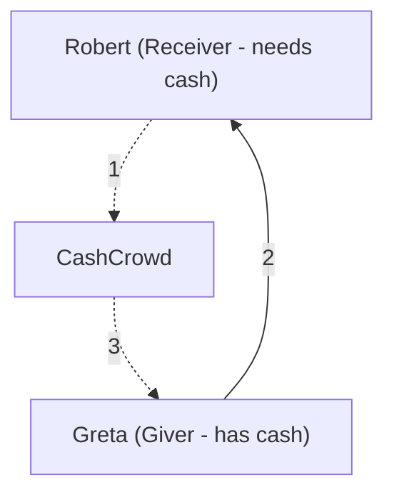

# Collabothon 2023

This repository contains our submission for the FutureFintech challenge of Collabothon 2023 (Frankfurt).

## Demo

[Deployed on Azure](https://brave-desert-0451bd303.4.azurestaticapps.net/)

## Description

**CashCrowd** combines solving multiple problems:

* How to get cash in (urgent) situations when you cannot get it from traditional sources (ATMs etc.)
* Provide an incentive for people to micro-invest in startups from developing countries with close to no effort
* Provide financial support to developing countries with close to no effort
* Provide incentive to donate to charities with close to no effort

Have you ever been in a situation where you need some cash because digital payment services are not supported or available but are not near an ATM or any other source of cash? Then you are in luck, that's exactly the problem **CashCrowd** helps you solve. You simply send out a request for cash (e.g. "I need $30"), which will then be transmitted to other users of the app in your vicinity. These people can then accept your request and the app will connect you via chat. After both parties agree on a meeting point, you can get your cash and the other person leaves with their cash being converted to money in their bank account (plus a small tip, which they can invest into developing countries with a single click). We, CashCrowd, handle the investments. Alternatively, this tip can also be donated to other causes or deposited to your bank account on request.

* CashCrowd handles the investment.
* CashCrowd is connected to your bank. This ensures all parties involved are real people.

> Who benefits? 

* Reciever: gets cash when needed. Eg: at night, in areas where ATMs are not easily available
* Giver: gets a commission from lending cash which can be automatically invested in 
developing countries and startups. Money can also easily be withdrawn or donated to
a suitable charity.
* Banks: Profit from "human" ATM machines. Also, cash is being converted to digital money and being automatically credited to the bank of the account holder.

## Cash flow 

To prevent Greta's cash being stolen: 

1. The amount of cash Robert needs is transferred to the middleman, CashCrowd. 
2. Once the transfer of cash is complete, Greta is alerted and hands the (physical) cash to Robert.
3. Robert confirms receipt of cash. CashCrowd transfers the digital amount to Greta's bank account directly. The tip Greta earns is credited to her CashCrowd account directly.

## Local Development Setup

    cd frontend
    yarn install
    yarn dev run

